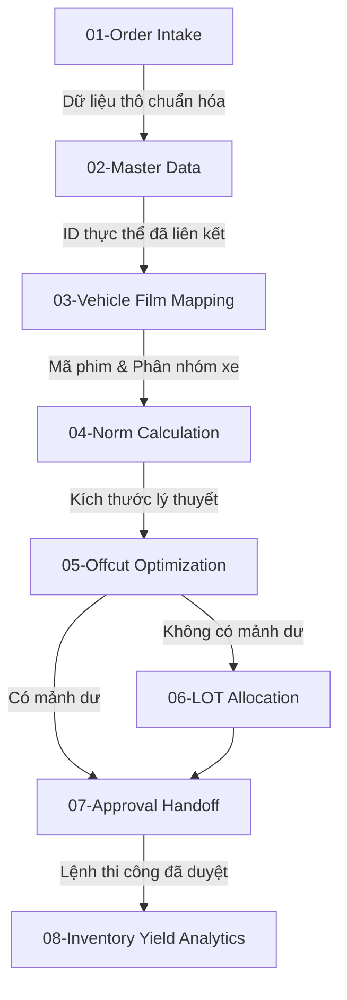

# Báo cáo Đánh giá Trách nhiệm Tác nhân (Agent Responsibility Review)

Tài liệu này thực hiện rà soát chuyên sâu về mặt hệ thống (Systematic Audit) đối với 8 tác nhân AI (Agent Persona) đã thiết lập trong dự án **DYC Film Warehouse Agentic Workspace** nhằm đảm bảo ranh giới trách nhiệm rõ ràng, không có sự chồng lấn, và loại bỏ các lỗ hổng logic vận hành.

---

## 1. Bản đồ Ranh giới Trách nhiệm giữa các Agent

Để tránh việc các Agent thực thi trùng lặp hoặc mâu thuẫn lệnh, hệ thống áp dụng nguyên tắc phân rã tính năng độc lập (Single Responsibility Principle - SRP):

| Agent ID & Name | Nhiệm vụ Độc quyền (Core Scope) | Giới hạn Đầu ra (Boundary Limits) |
| :--- | :--- | :--- |
| **01-Order Intake** | Bóc tách text thô thành JSON cấu trúc. | Không tự ý mapping mã phim hoặc kiểm tra tồn kho. |
| **02-Master Data** | Tra cứu và đối sánh Dealer, End Customer, VIN Xe. | Không can thiệp vào kích thước dán hay định mức phim. |
| **03-Vehicle Film Mapping** | Ánh xạ dòng xe sang phân nhóm (Sedan/SUV...) và dịch vụ sang mã phim. | Không tính toán chiều dài hay diện tích phim. |
| **04-Norm Calculation** | Tra định mức từ Excel/CSV và nhân hệ số an toàn. | Không kiểm tra tồn kho thực tế của LOT hay mảnh dư. |
| **05-Offcut Optimization** | Quét kho mảnh dư (`offcut_inventory`) tìm mảnh khớp tối ưu theo Match Score (>=80: ưu tiên, 60-79: cân nhắc, <60: bỏ qua). | Không được đề xuất cắt cuộn phim gốc (LOT gốc). |
| **06-LOT Allocation** | Đề xuất cuộn gốc dở dang hoặc cuộn mới theo FIFO. | Không quét mảnh dư và không tự động trừ tồn kho ảo. |
| **07-Approval Handoff** | Gửi bản tin duyệt cho Quản lý (HITL); tạo trạng thái Reserved/Soft Lock cho vật tư sau khi duyệt; phát lệnh KTV. | Nghiêm cấm tạo inventory transaction hoặc trừ tồn kho (chỉ dành cho Agent 8). |
| **08-Inventory Yield Analytics** | Nhận phản hồi KTV về kích thước thực tế, ghi nhận inventory transaction thực tế (trừ tồn kho LOT/Sub-LOT, tạo mảnh dư mới, ghi scrap) và xuất báo cáo. | Không bao giờ trừ tồn kho khi chưa có xác nhận kích thước thực tế từ Kỹ thuật viên. |

---

## 2. Phân tích các Điểm chồng lấn Tiềm năng và Giải pháp Kiểm soát

Trong quá trình thiết kế, nhóm BA đã phát hiện 4 điểm dễ xảy ra chồng lấn trách nhiệm giữa các tác nhân và đã xây dựng cơ chế kiểm soát tương ứng:

### Điểm 1: Bóc tách phiếu đại lý (Agent 1) vs. Định danh đối tác (Agent 2)
* **Nguy cơ chồng lấn**: Agent 1 có thể tự ý gán tên đại lý chính xác dựa trên suy đoán ngôn ngữ, lấn sân sang vai trò đối sánh Master Data của Agent 2.
* **Giải pháp**: Agent 1 chỉ giữ vai trò "thông dịch viên" cơ học - ghi nhận chính xác chuỗi ký tự tên đại lý thô ghi trên phiếu (`dealer_raw_name`). Việc phân tích từ khóa thô này thành mã đại lý hệ thống (`DEALER-LEXUS-SG`) thuộc trách nhiệm duy nhất của Agent 2 dựa trên tệp `dealer_account_master.csv`.

### Điểm 2: Xác định loại phim (Agent 3) vs. Tính định mức phim cần dán (Agent 4)
* **Nguy cơ chồng lấn**: Agent 3 khi mapping loại xe và dịch vụ dán có thể tự tính toán luôn diện tích cần dán vì đã có thông tin về phân nhóm xe.
* **Giải pháp**: Agent 3 chỉ dừng lại ở việc gán mã vật tư chuẩn (`material_code` ví dụ: `PPF-PRE-1.52`) và phân nhóm xe (`SUV_LARGE`). Agent 4 là thực thể duy nhất được phép mở tệp cấu hình ma trận định mức và áp dụng công thức nhân hệ số an toàn (Safety Margin 5% hoặc 10%) để xuất ra kích thước yêu cầu.

### Điểm 3: Tìm mảnh dư (Agent 5) vs. Phân bổ cuộn gốc (Agent 6)
* **Nguy cơ chồng lấn**: Nếu gộp chung thành một Agent quản lý kho chung, Agent có thể thiên vị việc cắt cuộn gốc cho nhanh chóng hoặc tính toán so khớp mảnh dư không triệt để.
* **Giải pháp**: Tách biệt hoàn toàn thành 2 Agent riêng biệt và chạy tuần tự. 
  * Agent 5 (Offcut Optimization) chạy trước, chỉ có quyền truy cập vào `offcut_inventory.csv`. Tiến hành phân loại đề xuất theo điểm Match Score: Match Score >= 80 (đề xuất ưu tiên dùng mảnh dư); Match Score từ 60 đến 79 (đưa vào danh sách cân nhắc, cần Quản lý xác nhận kỹ); Match Score < 60 (không đề xuất dùng mảnh dư, chuyển sang Agent 6).
  * Chỉ khi Agent 5 không tìm thấy mảnh dư phù hợp (kích thước không đạt hoặc Match Score < 60), Agent 6 (LOT Allocation) mới được kích hoạt để đề xuất cuộn gốc trong `lot_inventory.csv`.

### Điểm 4: Phát hành lệnh thi công (Agent 7) vs. Trừ kho và báo cáo (Agent 8)
* **Nguy cơ chồng lấn**: Agent 7 dán nhãn phê duyệt có thể tự ý thực hiện giao dịch trừ kho ảo theo định mức lý thuyết đã duyệt để đẩy nhanh quy trình.
* **Giải pháp**: Agent 7 chỉ được phép tạo trạng thái Reserved/Soft Lock cho cuộn LOT hoặc mảnh dư (Sub-LOT) sau khi Quản lý duyệt phương án cắt phim. Agent 7 tuyệt đối không được tạo inventory transaction hay thực hiện bất kỳ hành động trừ tồn kho nào. Agent 8 (Analytics Agent) là thực thể duy nhất chịu trách nhiệm thực thi giao dịch trừ kho thực tế và cập nhật trực tiếp vào cơ sở dữ liệu sau khi nhận được xác nhận kích thước thực tế từ Kỹ thuật viên (HITL-2).

---

## 3. Đánh giá tính sẵn sàng của Kiến trúc Agentic Workspace

* **Tính cô lập (Isolation)**: Các Agent hoạt động độc lập, giao tiếp với nhau bằng các thông điệp JSON có cấu trúc chặt chẽ (được định nghĩa trong thư mục `schemas/`).
* **Tính kiểm soát (Human-in-the-Loop)**: Hệ thống có hai chốt chặn con người cứng (Quản lý duyệt phương án trước khi thi công; Kỹ thuật viên xác nhận kích thước thực tế sau khi thi công). Điều này đảm bảo AI không thể tự ý làm sai lệch số liệu tồn kho vật lý.
* **Tính minh bạch (Auditability)**: Mọi thao tác thay đổi giá trị đề xuất của Agent từ phía Quản lý đều bắt buộc phải nhập lý do trên 10 ký tự. Mọi giao dịch kho ảo đều sinh mã Transaction ID và lưu vào nhật ký bất biến.

**Kết luận**: Cấu trúc 8 Agent được thiết kế hoàn toàn sạch, phân định ranh giới rõ ràng và sẵn sàng đi vào triển khai chi tiết cho các cấu phần tiếp theo.
