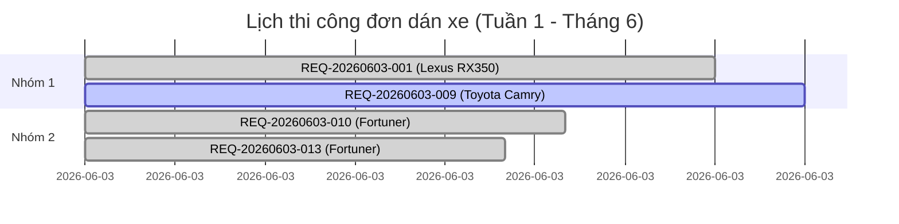

# Monthly Operation Dashboard (Bảng điều phối vận hành tháng)

## 1. Purpose
Tài liệu này đặc tả cấu trúc bảng điều phối hiệu suất vận hành theo tháng, giúp Quản lý vận hành và Kế toán kho đánh giá tổng thể công suất của xưởng dán xe DYC, theo dõi chỉ số SLA giao xe đúng hẹn, hiệu suất của Kỹ thuật viên, mức độ tiêu hao vật tư và hiệu quả tái sử dụng mảnh dư.

## 2. Interactive Filters (Bộ lọc tương tác)
* **Tháng/Năm**: 06/2026 (Mặc định).
* **Đại lý (Dealer)**: Tất cả / DEALER_LEXUS_SG / DEALER_TOYOTA_BENTHANH...
* **Kỹ thuật viên (Technician)**: Tất cả / KTV-001 / KTV-002 / KTV-003.
* **Dòng xe (Vehicle Model)**: Tất cả / LEXUS_RX350 / TOYOTA_CAMRY...
* **Mã phim cách nhiệt/PPF**: Tất cả / JB20 / RS20.
* **Trạng thái thi công**: Tất cả / CLOSED / IN_PROGRESS / EXCEPTION_HOLD.
* **Đúng hạn / Trễ hạn**: Tất cả / DELIVERED_ON_TIME / DELIVERED_LATE.

---

## 3. KPI Cards (Chỉ số hiệu suất cốt lõi)

| Chỉ số | Giá trị | Trạng thái / So sánh tháng trước | Ghi chú |
| :--- | :--- | :---: | :--- |
| **Tổng số phiếu dán** | 48 phiếu | 📈 +12% | Tổng yêu cầu tiếp nhận |
| **Tổng số xe thi công** | 48 xe | 📈 +12% | Một xe/phiếu |
| **Số phiếu Hoàn tất (Closed)** | 42 phiếu | `✅ 87.5%` | Đã giao xe & trừ kho ảo |
| **Số phiếu Đang thi công (In Progress)** | 3 phiếu | `⏳ 6.2%` | Đang dán tại buồng |
| **Số phiếu Bị trễ deadline (Delayed)** | 3 phiếu | `⚠️ 6.2%` | Trễ tiến độ giao xe |
| **Tỷ lệ đúng SLA giao xe** | 91.6% | 📈 +2.1% | Mục tiêu tối thiểu: 90% |
| **Thời gian dán trung bình** | 110 phút | 📉 -8 phút | Tính cho kính sườn + hậu |
| **Tỷ lệ tái sử dụng mảnh dư (Offcut)** | 64.2% | 📈 +4.5% | Mục tiêu tối thiểu: 60% |
| **Tỷ lệ phế liệu phát sinh (Scrap)** | 6.68% | 📉 -0.45% | Mục tiêu tối đa: 8% |

---

## 4. Visualized Metrics (Số liệu phân tích chi tiết)

### 4.1 Số đơn thi công theo ngày trong tháng (06/2026)

### 4.2 Số lượng xe thi công phân bổ theo Đại lý
* **Lexus Sài Gòn (DEALER_LEXUS_SG)**: 22 xe (45.8%)
* **Toyota Bến Thành (DEALER_TOYOTA_BENTHANH)**: 14 xe (29.2%)
* **BMW Phú Mỹ Hưng**: 8 xe (16.7%)
* **Khách lẻ vãng lai**: 4 xe (8.3%)

### 4.3 Đúng hạn vs Trễ hạn (SLA Delivery Status)
* **DELIVERED_ON_TIME**: 38 đơn (90.5% đơn hoàn thành)
* **DELIVERED_LATE**: 4 đơn (9.5% đơn hoàn thành)
  * *Nguyên nhân trễ*: 2 đơn do bong bóng keo kính hậu phải dán lại; 1 đơn do trễ bàn giao xe từ đại lý; 1 đơn do thiếu phim dở dang.

### 4.4 Top Kỹ thuật viên hoàn thành dán xe xuất sắc
1. **KTV-003**: 18 xe hoàn thành (Tỷ lệ đúng SLA: 94.4%, thời gian trung bình: 102 phút).
2. **KTV-002**: 15 xe hoàn thành (Tỷ lệ đúng SLA: 93.3%, thời gian trung bình: 112 phút).
3. **KTV-001**: 9 xe hoàn thành (Tỷ lệ đúng SLA: 88.9%, thời gian trung bình: 120 phút).

### 4.5 Top vật tư sử dụng & hao hụt
* **Mã phim JB20 (Window Film)**: Tiêu thụ 32 đơn, diện tích sử dụng: 68.4 m², phế liệu scrap: 4.2 m² (Scrap rate: 6.1%).
* **Mã phim RS20 (Window Film)**: Tiêu thụ 16 đơn, diện tích sử dụng: 35.2 m², phế liệu scrap: 2.7 m² (Scrap rate: 7.6%).

### 4.6 Cảnh báo cuộn gốc (LOT) sắp hết
* **LOT-JB20-001**: Còn lại `1.25m` (Vị trí kệ: `A-RACK-03` - Đề xuất thay thế bằng cuộn `LOT-JB20-002` mới).
* **LOT-RS20-003**: Còn lại `1.85m` (Vị trí kệ: `A-RACK-04`).

### 4.7 Cảnh báo mảnh dư (OFFCUT) tồn kho lâu ngày (Dead Stock)
* **SUBLOT-JB20-001**: Kích thước `1.52x1.50m`, kệ `OFFCUT-RACK-A`, tồn kho **92 ngày** chưa dùng.
* **SUBLOT-RS20-002**: Kích thước `1.52x1.10m`, kệ `OFFCUT-RACK-B`, tồn kho **85 ngày** chưa dùng.

---

## 5. Monthly Insights (Phân tích vận hành mẫu)
1. **Lexus Sài Gòn chiếm tỷ trọng chi phối**: Hơn 45% lượng đơn hàng đến từ đại lý Lexus Sài Gòn, đặc biệt tập trung vào phân khúc xe Luxury đòi hỏi tính thẩm mỹ cực cao (ví dụ: dòng Lexus RX350).
2. **Tỷ lệ tái sử dụng mảnh dư tăng trưởng**: Nhờ thuật toán so khớp mảnh dư ưu tiên của `Offcut Optimization Agent`, tỷ lệ tái sử dụng mảnh dư tăng lên mức kỷ lục 64.2%, giúp tiết kiệm ước tính 18.2m phim nguyên cuộn trong tháng 6.
3. **KTV-003 đạt hiệu suất vượt trội**: Kỹ thuật viên KTV-003 dẫn đầu cả về số lượng đơn hoàn thành (18 đơn) và tốc độ thi công trung bình, đồng thời giữ tỷ lệ đúng hạn dán xe ở mức xuất sắc 94.4%.
4. **Cảnh báo Dead Stock mảnh dư lớn**: Có 2 mảnh dư chất lượng cao trên 80 ngày chưa được tái sử dụng do kích thước dở dang kén dòng xe.
5. **Nguyên nhân trễ hạn giao xe**: Phần lớn các trường hợp trễ hạn (DELIVERED_LATE) phát sinh do lỗi dán bong bóng keo ở kính hậu, bắt buộc KTV phải bóc lớp phim cũ và dán lại từ đầu, tiêu thụ thêm phim và tốn thêm thời gian.

---

## 6. Recommended Actions (Hành động đề xuất)
1. **Thiết lập kế hoạch dọn kệ Dead Stock**: Ưu tiên chỉ định sử dụng 2 mảnh dư tồn kho trên 80 ngày (`SUBLOT-JB20-001` và `SUBLOT-RS20-002`) cho các đơn hàng dán xe SUV nhỏ hoặc dán khuyến mãi để giải phóng diện tích kệ.
2. **Chuẩn bị thay cuộn gốc JB20**: Đặt lịch chuẩn bị sẵn cuộn phim nguyên gốc mới thay thế cho cuộn `LOT-JB20-001` hiện chỉ còn lại 1.25m dở dang trên kệ.
3. **Đào tạo chuyên sâu về dán sấy kính hậu**: Tổ chức rà soát kỹ năng sấy dán nhiệt cho KTV-001 nhằm khắc phục dứt điểm lỗi bong keo kính hậu - nguyên nhân chính gây trễ hẹn và phát sinh scrap hỏng.
4. **Thưởng hiệu suất cho KTV xuất sắc**: Trao thưởng tháng cho KTV-003 để khuyến khích tinh thần làm việc đúng SLA và tối ưu chất lượng thi công.
5. **Cập nhật ma trận định mức dán nhóm**: Tiếp tục theo dõi chênh lệch planned block và actual block để tinh chỉnh biên an toàn trong ma trận `cutting_group_matrix.csv` sát với thực tế cắt hơn.
