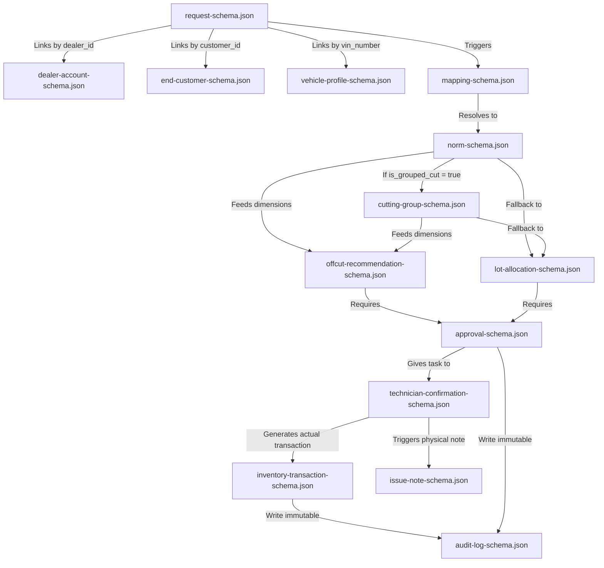

# Sơ đồ quan hệ giữa các JSON Schema (JSON Schema Relationship Map)

Tài liệu này đặc tả mối quan hệ, luồng dịch chuyển thông tin, và các trường khóa liên kết giữa 14 JSON Schemas phục vụ quản lý kho phim dán xe tại DYC.

---

## 1. Bản đồ tổng quan (Ingestion to Audit Trail)

---

## 2. Đặc tả chi tiết các liên kết khóa (Key Relations)

### 2.1. Nhóm Tiếp nhận và Chuẩn hóa (WF1 & WF2)
* **[request-schema.json](file:///d:/Qu%E1%BA%A3n%20l%C3%BD%20v%E1%BA%ADn%20h%C3%A0nh%20DYC/schemas/request-schema.json)** đóng vai trò là thực thể trung tâm chứa:
  * `dealer_id`: Khóa ngoại liên kết sang `dealer-account-schema.json` để kiểm tra thông tin đại lý B2B.
  * `customer_id`: Khóa ngoại liên kết sang `end-customer-schema.json` để lưu trữ hồ sơ chủ xe lẻ.
  * `vehicle_id` và `vin_number`: Khóa ngoại liên kết sang `vehicle-profile-schema.json` để kiểm tra lịch sử và cảnh báo tranh chấp sở hữu số khung xe.

### 2.2. Nhóm Ánh xạ và Định mức (WF3)
* Phiếu yêu cầu chuyển sang bước mapping sử dụng **[mapping-schema.json](file:///d:/Qu%E1%BA%A3n%20l%C3%BD%20v%E1%BA%ADn%20h%C3%A0nh%20DYC/schemas/mapping-schema.json)** để tra cứu tổ hợp xe dán ra mã vật tư phim dán.
* Sau khi có mã phim, tra cứu **[norm-schema.json](file:///d:/Qu%E1%BA%A3n%20l%C3%BD%20v%E1%BA%ADn%20h%C3%A0nh%20DYC/schemas/norm-schema.json)** để lấy định mức lý thuyết.
  * *Liên kết Cutting Group*: Nếu trường `is_grouped_cut == true` trong `norm-schema.json`, hệ thống bắt buộc phải bỏ qua định mức lẻ và lấy khóa `cut_group_id` truy vấn sang **[cutting-group-schema.json](file:///d:/Qu%E1%BA%A3n%20l%C3%BD%20v%E1%BA%ADn%20h%C3%A0nh%20DYC/schemas/cutting-group-schema.json)** để lấy thông số khối cắt gom (`cut_block_width_cm`, `cut_block_length_cm`, `deduction_length_m`).

### 2.3. Nhóm Đề xuất và Phê duyệt (WF4 & WF5)
* Kích thước yêu cầu (đơn lẻ từ `norm-schema.json` hoặc khối cắt từ `cutting-group-schema.json`) được truyền vào thuật toán tối ưu so khớp:
  * **[offcut-recommendation-schema.json](file:///d:/Qu%E1%BA%A3n%20l%C3%BD%20v%E1%BA%ADn%20h%C3%A0nh%20DYC/schemas/offcut-recommendation-schema.json)**: Đề xuất sử dụng mảnh dư, so khớp diện tích theo `cut_block` nếu dán nhóm.
  * **[lot-allocation-schema.json](file:///d:/Qu%E1%BA%A3n%20l%C3%BD%20v%E1%BA%ADn%20h%C3%A0nh%20DYC/schemas/lot-allocation-schema.json)**: Đề xuất khui cuộn gốc theo FIFO, lượng trừ được tính một lần duy nhất theo `deduction_length_m` của group.
* Cả 2 đề xuất được đóng gói vào **[approval-schema.json](file:///d:/Qu%E1%BA%A3n%20l%C3%BD%20v%E1%BA%ADn%20h%C3%A0nh%20DYC/schemas/approval-schema.json)** để trình Quản lý duyệt.
  * *Ràng buộc Soft Lock*: Trường `virtual_status` trong schema này ghi nhận trạng thái duy nhất sau duyệt là `SOFT_LOCKED_RESERVED` (khóa ảo ảo, không trừ tồn vật lý).

### 2.4. Nhóm Thi công, Trừ kho và Kiểm toán (WF6)
* Sau khi KTV hoàn thành thi công, KTV khai báo số liệu thực tế sử dụng thông qua **[technician-confirmation-schema.json](file:///d:/Qu%E1%BA%A3n%20l%C3%BD%20v%E1%BA%ADn%20h%C3%A0nh%20DYC/schemas/technician-confirmation-schema.json)**.
* Hệ thống tiếp nhận số liệu thực tế và sinh ra **[inventory-transaction-schema.json](file:///d:/Qu%E1%BA%A3n%20l%C3%BD%20v%E1%BA%ADn%20h%C3%A0nh%20DYC/schemas/inventory-transaction-schema.json)** để trừ kho thực tế.
  * Schema này phân biệt rõ nguồn tác động qua `source_type` (`LOT`, `OFFCUT` hoặc `MANUAL_ADJUSTMENT`), phân loại nghiệp vụ qua `transaction_type` (như `ISSUE_FROM_LOT`, `ISSUE_FROM_OFFCUT`, `CREATE_OFFCUT`, `RECORD_SCRAP` để ghi nhận phế liệu, `ADJUSTMENT`, `RELEASE_LOCK`), so khớp `planned_cut_block` vs `actual_cut_block` và ghi nhận `cut_group_id` để kiểm soát chênh lệch. Giao dịch cũng ghi nhận đầy đủ `transaction_status` và `lock_released` để đối soát trạng thái khóa ảo.
* Đồng thời, Admin kho lập **[issue-note-schema.json](file:///d:/Qu%E1%BA%A3n%20l%C3%BD%20v%E1%BA%ADn%20h%C3%A0nh%20DYC/schemas/issue-note-schema.json)** làm chứng từ xuất kho vật lý.
* Toàn bộ thay đổi dữ liệu (đặc biệt là điều chỉnh kích thước kế hoạch của Quản lý hay chênh lệch cắt thực tế của KTV) đều được ghi nhận bất biến vào **[audit-log-schema.json](file:///d:/Qu%E1%BA%A3n%20l%C3%BD%20v%E1%BA%ADn%20h%C3%A0nh%20DYC/schemas/audit-log-schema.json)** (lưu vết `before_value`, `after_value`, `reason`, `actor`, `timestamp`).
