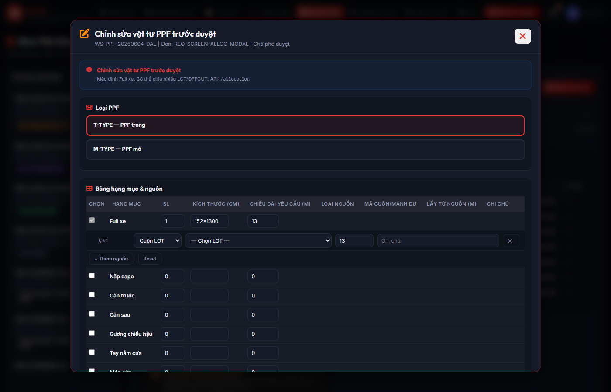
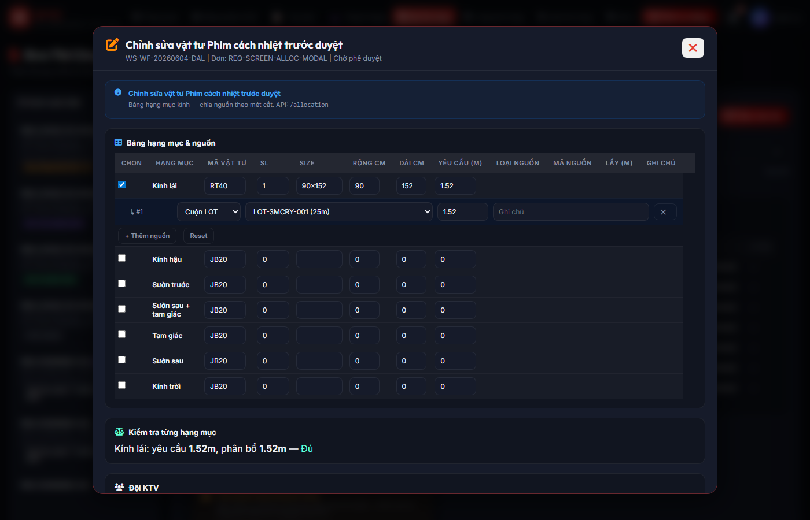
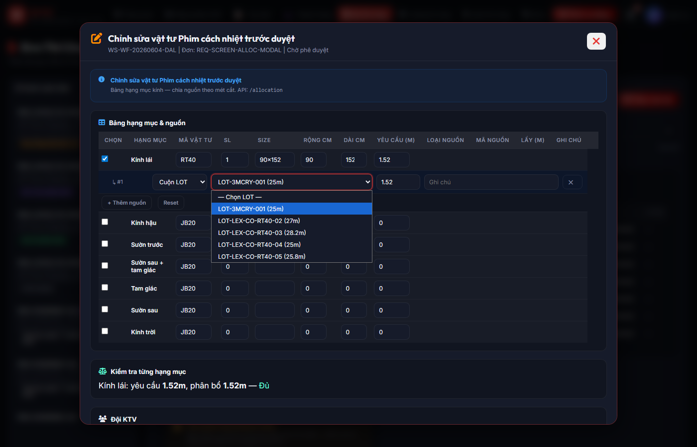
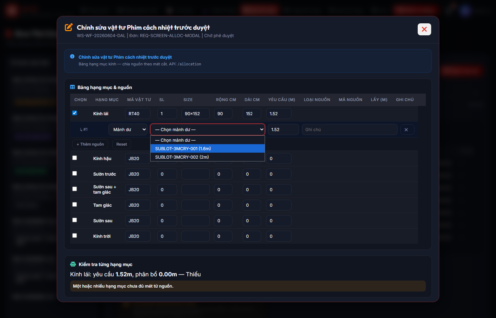

# Workstream Allocation Common — Báo cáo cập nhật

## 1. Mục đích

Tài liệu hóa luồng **chung** phân bổ vật tư cho **PPF_INSTALLATION** và **WINDOW_FILM_INSTALLATION**: một API `PUT /allocation`, bảng hạng mục đồng nhất, nguồn LOT/OFFCUT (multi-source), không trừ kho khi chỉnh trước duyệt, soft lock khi Manager duyệt, commit từng nguồn khi KTV hoàn tất (WF6).

---

## 2. Trả lời checklist nghiệp vụ / kỹ thuật

| # | Nội dung | Kết luận |
|---:|---|---|
| 1 | PPF và Window Film đã dùng chung API allocation chưa? | **Có.** UI và smoke ưu tiên `PUT /api/workstreams/{workstream_id}/allocation`. Nhánh PPF xử lý payload PPF; nhánh WF dùng `wf_allocation` / `wf_allocation_json`. |
| 2 | PPF và Window Film đã dùng chung modal / table logic chưa? | **Có.** `static/workstream_allocation_modal.js` — một modal, cùng layout cột. `static/index.html` load script này; `chiinhSuaWs` trong `static/app.js` mở modal chung khi `PENDING_APPROVAL`. |
| 3 | API active-options cho LOT / OFFCUT đã có chưa? | **Có.** `GET /api/inventory/lots/active-options`, `GET /api/inventory/offcuts/active-options`. |
| 4 | Smoke test có đủ tối thiểu 18 case chưa? | **Có.** `workstream_allocation_common_smoke_test.py`: **20** case (#1–#16 allocation; #17–#19 regression; #20 GET `wf_allocation`). |
| 5 | Ảnh modal | **Screenshot thật** từ web demo (Chromium + `uvicorn`), lưu tại `audit/screenshots/` — xem mục 4. Script tái chụp: `python audit/capture_allocation_modal_screenshots.py` (cần `pip install playwright` và `python -m playwright install chromium`). |
| 6 | Legacy `POST /api/workstreams/{id}/edit` | **Vẫn có** cho backward compatibility. **UI chính** allocation dùng **`PUT .../allocation`**. |

---

## 3. Material Preference Consistency

- **Kính lái (WINDSHIELD):** `material_code` lấy từ **Material Preference** (`DbMaterialPreference` + `resolve_material_preference`) và định mức xe; smoke **không** ép JB20 cho kính lái.
- **Modal / API:** không hardcode RT40/JB20 trong UI allocation; giá trị hiển thị theo plan + preference.
- **Đổi vật tư khác mặc định:** bắt buộc `change_reason` / `material_override_reason` (theo rule API manual-create & WF allocation); audit `REQUEST_MATERIAL_OVERRIDDEN` khi đổi so với proposal (đã có trong backend).
- **Case #10 smoke (Hướng A — happy path):** `PUT allocation WF WINDSHIELD + LOT` dùng LOT đúng **`material_code` trùng preference** (seed hiện tại: WINDSHIELD → **RT40**). Script seed bảo đảm kính lái có kích thước định mức (90×152 cm) để `is_selected = true`. LOT trong DB có thể có `lot_id` mang tên khác mã vật tư (ví dụ tiền tố 3M) nhưng **`material_code` trên bản ghi LOT vẫn là RT40** — cần phân biệt **mã cuộn** và **mã vật tư**.

---

## 4. API mới / đã chỉnh (tóm tắt)

| Method | Path | Ghi chú |
|--------|------|--------|
| `PUT` | `/api/workstreams/{workstream_id}/allocation` | Entry chung; PPF + WF. Không trừ kho tại bước này. |
| `GET` | `/api/inventory/lots/active-options` | LOT phù hợp `material_code`, active, không lock bởi request khác. |
| `GET` | `/api/inventory/offcuts/active-options` | OFFCUT đủ điều kiện nghiệp vụ. |
| `PUT` | `/api/workstreams/{id}/ppf-allocation` | Legacy tương thích. |
| `POST` | `/api/workstreams/{id}/edit` | Legacy; không dùng làm UI chính allocation. |

---

## 5. Ảnh modal — screenshot thật (web demo)

Ảnh dưới được tạo bằng Playwright trên `http://127.0.0.1:9788/` sau khi seed request `REQ-SCREEN-ALLOC-MODAL` (script `audit/capture_allocation_modal_screenshots.py`). **Không phải mock.**

### 5.1 PPF — modal phân bổ chung



- File: `web_demo/audit/screenshots/modal-ppf-allocation-common-real.png`

### 5.2 Window Film — modal phân bổ chung



- File: `web_demo/audit/screenshots/modal-window-film-allocation-common-real.png`

### 5.3 Dropdown LOT (WF — sau khi focus select nguồn)



- File: `web_demo/audit/screenshots/allocation-lot-active-options-real.png`

### 5.4 Dropdown OFFCUT (WF — chuyển loại nguồn sang OFFCUT)



- File: `web_demo/audit/screenshots/allocation-offcut-active-options-real.png`

### 5.5 Mock tham chiếu cũ (tùy chọn, không bắt buộc cho demo)

- `audit/screenshots/modal-ppf-preflight-dyc-ref.png`, `modal-wf-edit-dyc-ref.png` — chỉ minh họa bố cục cũ.

---

## 6. Kết quả `workstream_allocation_common_smoke_test.py`

```bash
cd web_demo
# Khuyến nghị: DB sạch khi cần kết quả ổn định cho toàn bộ regression lồng nhau
python workstream_allocation_common_smoke_test.py
```

Bảng case (đồng bộ tên với script):

| # | Case | Result |
|---:|---|:---:|
| 1 | GET lots/active-options JB20 | **PASS** |
| 2 | GET offcuts/active-options JB20 | **PASS** |
| 3 | lots/active-options không gồm LOT CLOSED | **PASS** |
| 4 | offcuts/active-options không gồm USED (seed tạm) | **PASS** |
| 5 | PUT allocation PPF 1 nguồn đủ 13m | **PASS** |
| 6 | PUT allocation PPF 2 nguồn đủ 13m | **PASS** |
| 7 | PUT PPF tổng < 13m fail | **PASS** |
| 8 | PUT PPF đổi nguồn thiếu reason fail | **PASS** |
| 9 | PUT PPF tick phụ qty=0 fail | **PASS** |
| 10 | PUT allocation WF WINDSHIELD + LOT theo Material Preference | **PASS** |
| 11 | PUT WF WINDSHIELD + OFFCUT (nếu có offcut cùng `material_code` kính lái) | **PASS** |
| 12 | PUT WF source material mismatch fail | **PASS** |
| 13 | PUT WF đổi nguồn thiếu reason fail | **PASS** |
| 14 | PUT WF/PPF source locked bởi request khác fail | **PASS** |
| 15 | Manager approve WF — soft lock nguồn | **PASS** |
| 16 | WF6 complete WF — trừ LOT + release lock | **PASS** |
| 17 | `material_preference_manual_order_smoke_test.py` | **PASS** |
| 18 | `inventory_admin_smoke_test.py` | **PASS** |
| 19 | `manual_order_customer_smoke_test.py` | **PASS** |
| 20 | GET workstreams — `wf_allocation` khi có dữ liệu | **PASS** |

```
WORKSTREAM ALLOCATION COMMON SMOKE TEST PASSED
```

**Regression chạy riêng (sau smoke chung):** trên cùng file `warehouse_demo.db` đã qua nhiều lần smoke, `material_preference_manual_order_smoke_test.py` có thể **thoát mã 1** do subprocess `customer_filters_address_norm_smoke_test.py` (IntegrityError trùng audit/Lot) — lỗi dữ liệu tích lũy, không phải regression allocation. Cách xử lý: xóa `web_demo/warehouse_demo.db` rồi chạy lại, hoặc chỉ chạy `inventory_admin_smoke_test.py` và `manual_order_customer_smoke_test.py` (hai script này thường PASS sau smoke chung).

---

## 7. Dữ liệu smoke

- Request allocation chung: `REQ-CMN78-WSALLOC` (script xóa/tạo lại mỗi lần).
- WF chỉ gói **WINDSHIELD**; vật tư kính lái theo preference (RT40 trong seed); PPF dùng LOT **T-TYPE**.

---

## 8. Trạng thái cuối

**WORKSTREAM ALLOCATION COMMON READY FOR DEMO**

(Điều kiện: `workstream_allocation_common_smoke_test.py` PASS đủ 20 case trên DB sạch; screenshot thật đã có trong `audit/screenshots/`; regression `inventory_admin` + `manual_order_customer` PASS khi chạy sau smoke chung.)
