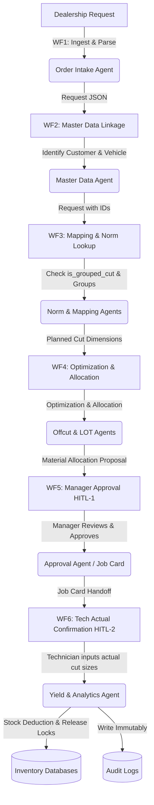

# Workflow Name
Quy trình vận hành kho phim dán xe đầu cuối (End-to-End Film Warehouse Operations Workflow Overview)

# Business Purpose
Định nghĩa luồng vận hành đầu cuối (E2E) từ khi đại lý gửi yêu cầu dán xe, qua các bước chuẩn hóa, lập phương án cắt tối ưu, phê duyệt của Quản lý, Kỹ thuật viên cắt dán thực tế, trừ tồn kho và ghi nhật ký kiểm toán bất biến. Hướng dẫn cách phối hợp toàn bộ 6 workflows trên thành một chuỗi vận hành khép kín và an toàn.

# Trigger
Hệ thống nhận được yêu cầu thi công dán xe mới từ đại lý Lexus hoặc khách lẻ vãng lai.

# Actors
* Admin kho/Điều phối (Tiếp nhận, chuẩn hóa, giám sát hàng chờ)
* Quản lý Kho Kỹ thuật (Phê duyệt phương án cấp phát vật tư, xử lý định mức và ngoại lệ)
* Kỹ thuật viên (Cắt dán phim, báo cáo thực tế thi công)
* Kế toán kho (Giám sát báo cáo hiệu suất vật tư, đối soát kiểm kê)

# Agents Involved
* Tất cả 8 AI Agents trong workspace (từ Intake Agent đến Inventory Yield & Analytics Agent).

# Input
* Yêu cầu thi công thô ban đầu (file PDF, Excel, Email, hoặc nhập tay).

# Output
* Đơn hàng hoàn tất dán phim thực tế trên xe.
* Tồn kho ảo được trừ chính xác.
* Mảnh dư mới được tạo và lưu kho vật lý/kho ảo.
* Log giao dịch kiểm toán được ghi nhận vĩnh viễn.

# Main Flow
1. **Tiếp nhận yêu cầu (WF1)**: Nhận yêu cầu thi công từ đại lý. Order Intake Agent bóc tách VIN, model xe, đại lý, dịch vụ. Loại bỏ các yêu cầu không hợp lệ (ví dụ: thiếu đại lý hoặc thiếu VIN).
2. **Liên kết Master Data (WF2)**: Chuẩn hóa thông tin đối tác. Master Data Agent thực hiện khử trùng lặp khách hàng (cấm tự ý gộp nếu chỉ trùng họ tên) và kiểm tra trùng lặp VIN (phát cảnh báo xung đột chủ xe).
3. **Ánh xạ và Định mức (WF3)**: Vehicle Film Mapping Agent ánh xạ xe và hạng mục dán ra loại vật tư và mã phim chuẩn. Norm Calculation Agent tính định mức lý thuyết (kèm margin), kiểm tra cờ nhóm cắt (`is_grouped_cut = true`) để gom block cắt theo quy định tại `cutting_group_matrix.csv`.
4. **Tối ưu hóa và Đề xuất (WF4)**: Offcut Optimization Agent quét tìm mảnh dư khả dụng khớp với khổ khối cắt. Nếu khớp một phần, đánh dấu `PARTIAL_MATCH`. Nếu không có mảnh dư đạt Match Score, LOT Allocation Agent đề xuất cắt cuộn gốc theo thứ tự FIFO. Tạo phương án đề xuất vật tư, chưa khóa vật tư.
5. **Ký duyệt phương án (WF5)**: Approval Handoff Agent trình phương án cho Quản lý. Quản lý trực tiếp ký duyệt (HITL-1). Nghiêm cấm Agent tự động duyệt. Trạng thái APPROVED mới chính thức tạo Reserved/Soft Lock cho LOT hoặc OFFCUT được chọn trong kho ảo, cấm trừ kho vật lý. Hệ thống tự động sinh Job Card gửi cho Kỹ thuật viên.
6. **Thi công và Trừ kho (WF6)**: KTV thực hiện cắt dán phim theo Job Card, đo đạc kích thước thực tế và xác nhận hoàn thành (HITL-2). Agent trừ kho ảo một lần duy nhất cho cả Cutting Group theo số liệu thực tế, giải phóng Soft Lock, tự động tạo mảnh dư mới hoặc ghi nhận scrap và ghi Audit Log kiểm toán.

# Alternative Flows
* **Alternative Flow O.1 - Xử lý Khớp một phần ở bước Phân bổ (Partial Match Handling)**:
  * Nếu WF4 báo mảnh dư khớp một phần, luồng chuyển hướng trực tiếp đến màn hình Quản lý kỹ thuật ở WF5 để quyết định tách cắt lẻ nhằm tận dụng mảnh dư trước khi đi tiếp.
* **Alternative Flow O.2 - Tự ý tách nhóm thi công thực tế của KTV (Tech Override)**:
  * Ở WF6, do tình hình thực tế, KTV không cắt theo block dán gom được phê duyệt. KTV chọn phương án cắt lẻ, nhập `actual_cut_block` khác với kế hoạch, gõ lý do ngoại lệ. Agent ghi nhận, trừ kho lẻ tương ứng và kích hoạt cảnh báo gửi cho Kế toán kho.
* **Alternative Flow O.3 - Điều chỉnh chênh lệch kho trực tiếp (Inventory Stock Adjustment)**:
  * Khi Kế toán kho phát hiện chênh lệch thực tế vs sổ sách, tiến hành thực hiện giao dịch chỉnh sửa tồn kho trực tiếp qua hệ thống quản trị, bỏ qua toàn bộ WF1-WF5, đi thẳng vào ghi log kiểm toán ở WF6.

# Exception Flows
* **Exception Flow O.1 - Dừng luồng do thiếu dữ liệu đại lý (WF1)**:
  * Yêu cầu thi công B2B không có thông tin đại lý gửi. Luồng dừng lập tức và đẩy về cho Admin kho xử lý thủ công, không đi tiếp sang WF2.
* **Exception Flow O.2 - Xung đột sở hữu xe (WF2)**:
  * VIN trùng khớp nhưng chủ xe khác biệt. Luồng dừng, chuyển trạng thái phiếu thành `SUSPENDED_CONFLICT` và chờ Admin kho đối soát thực tế.
* **Exception Flow O.3 - Tồn kho ảo bị âm khi trừ kho thực tế (WF6)**:
  * Chiều dài KTV báo cáo vượt quá số dư còn lại của cuộn phim trong kho ảo. Giao dịch trừ kho bị dừng, hệ thống gán cờ lệch kho và báo động cho Kế toán kho.

# Human Checkpoints
* **Admin kho (WF1, WF2)**: Xử lý dữ liệu rác, VIN xung đột.
* **Quản lý Kho Kỹ thuật (WF3, WF5)**: Xử lý định mức thiếu, điều chỉnh và duyệt phương án cấp phát vật tư (HITL-1).
* **Kỹ thuật viên (WF6)**: Nhập kích thước thực tế sử dụng và xác nhận chất lượng mảnh dư (HITL-2).
* **Kế toán kho (WF6)**: Giám sát đối soát chênh lệch kho vật lý và kho ảo.

# Rules Applied
* Tất cả các quy tắc từ [R1-intake-validation-rules.md](file:///d:/Qu%E1%BA%A3n%20l%C3%BD%20v%E1%BA%ADn%20h%C3%A0nh%20DYC/rules/R1-intake-validation-rules.md) đến [R9-audit-log-rules.md](file:///d:/Qu%E1%BA%A3n%20l%C3%BD%20v%E1%BA%ADn%20h%C3%A0nh%20DYC/rules/R9-audit-log-rules.md).

# Audit Events
* Toàn bộ các sự kiện kiểm toán được kích hoạt và lưu vết bất biến xuyên suốt chuỗi vận hành: `REQ_RECEIVED`, `CUSTOMER_MERGED`, `VIN_OWNER_CONFLICT_ALERT`, `NORM_LOOKUP_FAILED`, `OFFCUT_MATCHED`, `APPROVAL_GRANTED`, `INVENTORY_TRANSACTION_LOGGED`.

# Completion Criteria
* Xe được thi công hoàn tất, cuộn phim/mảnh dư ảo được cập nhật tồn kho chính xác theo số liệu thực tế, giải phóng khóa ảo, và log giao dịch kho được lưu vết bất biến.

# Status Flow
`DRAFT` -> `PROCESSING` -> `VALIDATED` -> `STANDARDIZED` -> `NORM_ASSIGNED` -> `ALLOCATED` -> `PENDING_APPROVAL` -> `APPROVED` -> `TECH_CONFIRMING` -> `COMPLETED`.
