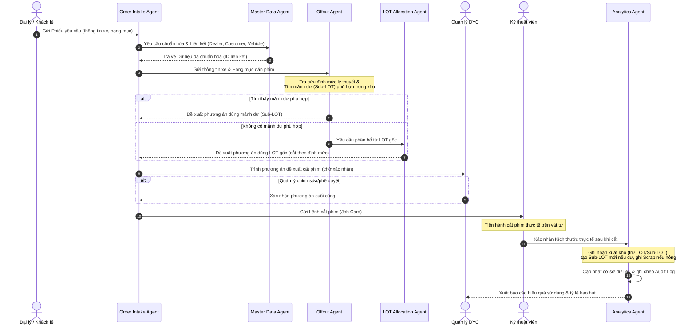

# Workspace Specification: DYC Film Warehouse Agentic Workspace

Tài liệu đặc tả kiến trúc hệ thống Agentic Workspace quản lý kho phim cách nhiệt và PPF của DYC. Tài liệu này đóng vai trò là "Blueprint" định hướng hoạt động cho toàn bộ hệ thống Agent và Con người tham gia dự án.

---

## 1. Project Overview
Dự án **DYC Film Warehouse Agentic Workspace** là một không gian làm việc cộng tác đa tác nhân (Multi-Agent) kết hợp với con người (Human-in-the-Loop) nhằm tối ưu hóa quy trình quản lý, tính toán định mức, cắt phim và kiểm soát hao hụt kho phim cách nhiệt và phim PPF (Paint Protection Film) dành cho ô tô tại công ty DYC.

## 2. Business Context
DYC là đơn vị chuyên thi công Phim cách nhiệt và PPF cao cấp cho ô tô.
* **Đối tác doanh nghiệp (Dealer)**: Hiện tại, khách hàng chính là các đại lý ô tô lớn (ví dụ: *Lexus Trung Tâm Sài Gòn – Công Ty TNHH Ôtô Toyotsu Samco*). Hệ thống được thiết kế mở rộng để quản lý nhiều Dealer khác trong tương lai.
* **Khách hàng lẻ (End Customer)**: Là chủ xe trực tiếp. Thông tin khách lẻ có thể được lấy từ phiếu yêu cầu của Dealer hoặc khách lẻ tự mang xe đến xưởng DYC thi công.
* **Quy trình hoạt động**: DYC tiếp nhận phiếu yêu cầu thi công từ Dealer hoặc trực tiếp từ khách lẻ, thực hiện lập phương án cắt phim tối ưu (tái sử dụng mảnh dư hoặc dùng cuộn phim gốc), chờ phê duyệt, cắt phim thực tế, cập nhật kho và lập báo cáo.

## 3. Business Problems
* **Hao hụt vật tư lớn**: Phim PPF và phim cách nhiệt là vật tư cao cấp có giá trị lớn. Việc cắt phim không có kế hoạch tối ưu dẫn đến vứt bỏ nhiều mảnh dư có thể tái sử dụng, gây lãng phí nghiêm trọng.
* **Theo dõi tồn kho mảnh dư khó khăn**: Các mảnh dư (Offcut/Sub-LOT) sau khi cắt thường không được định danh và lưu trữ đúng cách, dẫn đến việc thủ kho hoặc kỹ thuật viên tiếp tục cắt cuộn phim gốc (LOT gốc) mới dù trong kho vẫn còn các mảnh dư phù hợp.
* **Dữ liệu phân mảnh**: Thông tin từ phiếu yêu cầu của đại lý, thông tin chủ xe (End Customer), hồ sơ xe (Vehicle Profile) và lịch sử thi công bị lưu trữ rời rạc, gây khó khăn cho việc tra cứu bảo hành và thống kê.
* **Thiếu sự kiểm soát chặt chẽ**: Không có chốt chặn kiểm soát (Human Checkpoint) dẫn đến việc kỹ thuật viên tự ý xuất kho phim mà không có phương án được phê duyệt, hoặc xuất kho sai lệch số lượng thực tế.

## 4. Business Goals
* **Tối ưu hóa tỷ lệ sử dụng phim**: Tăng tỷ lệ tái sử dụng mảnh dư (Offcut), giảm tỷ lệ phế liệu (Scrap) xuống dưới mức quy định cho từng dòng sản phẩm.
* **Tự động hóa tính định mức**: Tra cứu tự động định mức chuẩn từ file Excel cấu hình dựa trên model xe và hạng mục thi công.
* **Kiểm soát xuất kho nghiêm ngặt**: Đảm bảo 100% giao dịch xuất kho vật tư phải thông qua phương án cắt phim được duyệt và được kỹ thuật viên xác nhận kích thước thực tế sau khi cắt.
* **Chuẩn hóa Master Data**: Tạo cơ chế liên kết chặt chẽ giữa Đại lý (Dealer), Khách lẻ (End Customer) và Hồ sơ xe (Vehicle Profile).
* **Minh bạch hóa dữ liệu**: Cung cấp báo cáo chính xác về hiệu suất sử dụng của từng LOT phim, tỷ lệ hao hụt và danh sách mảnh dư tồn lâu ngày.

## 5. Scope In
* **Tiếp nhận & Chuẩn hóa phiếu yêu cầu**: Đọc thông tin từ phiếu của đại lý (Lexus Sài Gòn...) hoặc phiếu khách lẻ để bóc tách thông tin.
* **Quản lý thực thể**: Quản lý Đại lý (Dealer Account), Khách lẻ (End Customer) và Hồ sơ xe (Vehicle Profile).
* **Tính toán định mức lý thuyết**: Tra cứu file định mức chuẩn (`Phim cách nhiệt - Định mức chuẩn.xlsx`, `Phim PPF - Định mức chuẩn.xlsx`) dựa trên model xe và hạng mục thi công.
* **Thuật toán tối ưu hóa mảnh dư (Offcut)**: Tự động so khớp kích thước phim cần cắt với các mảnh dư hiện có trong kho.
* **Luồng phê duyệt (Approval Workflow)**: Trình quản lý duyệt phương án cắt, cho phép điều chỉnh.
* **Báo cáo và Phân tích**: Báo cáo hao hụt, tái sử dụng, cảnh báo kho.
* **Hệ thống Nhật ký chỉnh sửa (Audit Log)**: Ghi lại mọi hành động thay đổi dữ liệu kho hoặc phương án.

## 6. Scope Out
* **Kế toán tài chính & Công nợ**: Không quản lý dòng tiền, hóa đơn đỏ hoặc công nợ đại lý chi tiết.
* **Quản lý nhân sự & Bảng lương**: Không quản lý chấm công, lương thưởng của kỹ thuật viên.
* **Thi công thực tế**: Hệ thống chỉ quản lý về mặt thông tin, số liệu và lệnh cắt vật tư, không can thiệp vào quy trình dán phim vật lý.

## 7. Core End-to-End Flow

## 8. Agentic Workspace Architecture
Hệ thống được thiết kế theo mô hình **Collaborative Multi-Agent Architecture** tích hợp **Human-in-the-Loop (HITL)**:
* **Storage Layer (Knowledge & Rules)**: Lưu trữ dữ liệu cấu hình định mức, lịch sử tồn kho, dữ liệu khách hàng dưới dạng file CSV/Markdown để đảm bảo tính tường minh và dễ dàng truy cập bởi Agents.
* **Logic Layer (Modules)**: Các module chức năng được định nghĩa rõ ràng về Input, Output và thuật toán xử lý để các Agent gọi thực thi.
* **Orchestration Layer (Workflows)**: Các tệp quy trình hướng dẫn chi tiết cho các Agent phối hợp theo thứ tự tuần tự hoặc song song.
* **Interaction Layer (Human Personas)**: Các điểm chạm tương tác, nơi con người kiểm tra, chỉnh sửa hoặc phê duyệt quyết định của Agent.

## 9. 8 Agents Overview
1. **01-order-intake-agent.md**: Tiếp nhận phiếu yêu cầu thi công, bóc tách thông tin thô, phát hiện tính hợp lệ của dữ liệu đầu vào.
2. **02-customer-dealer-master-data-agent.md**: Chuẩn hóa thông tin đối tác, phân biệt đại lý và khách lẻ, khử trùng lặp dữ liệu, liên kết và cập nhật Hồ sơ xe.
3. **03-vehicle-film-mapping-agent.md**: Mapping dòng xe (Sedan, SUV...) sang các mã hàng phim cách nhiệt hoặc PPF tương ứng dựa trên hạng mục yêu cầu.
4. **04-norm-calculation-agent.md**: Đọc và tra cứu file định mức Excel (`Phim cách nhiệt - Định mức chuẩn.xlsx`, `Phim PPF - Định mức chuẩn.xlsx`) để đưa ra diện tích/kích thước phim lý thuyết cần thiết.
5. **05-offcut-optimization-agent.md**: Tìm kiếm trong kho các mảnh dư (Sub-LOT) có kích thước thỏa mãn yêu cầu cắt với độ hao hụt nhỏ nhất.
6. **06-lot-allocation-agent.md**: Trong trường hợp không có mảnh dư phù hợp, tính toán và đề xuất cắt từ cuộn phim gốc (LOT gốc) đang hoạt động.
7. **07-approval-handoff-agent.md**: Tổng hợp phương án đề xuất, đóng gói bản tin gửi cho Quản lý phê duyệt (HITL) và chuyển lệnh thi công xuống cho Kỹ thuật viên sau khi được duyệt.
8. **08-inventory-yield-analytics-agent.md**: Ghi nhận phản hồi thực tế của Kỹ thuật viên, thực hiện các giao dịch xuất nhập kho ảo, ghi scrap, và kết xuất báo cáo định kỳ.

## 10. 11 Business Modules Overview
1. **M1-quan-ly-phieu-dai-ly-lexus.md**: Xử lý biểu mẫu phiếu yêu cầu đặc thù của đại lý Lexus Toyotsu Samco và các đại lý khác.
2. **M2-quan-ly-khach-hang-dai-ly.md**: API/Logic quản lý thông tin tài khoản đại lý (Dealer Account) và chính sách đi kèm.
3. **M3-quan-ly-ho-so-xe-khach-hang.md**: Lưu trữ và truy vấn thông tin mối quan hệ 3 bên: Xe - Khách lẻ - Đại lý.
4. **M4-danh-muc-xe.md**: Phân loại và tra cứu kích thước các dòng xe ô tô trên thị trường.
5. **M5-danh-muc-vat-tu-phim.md**: Quản lý thông tin kỹ thuật, nguồn gốc của các mã phim cách nhiệt và PPF.
6. **M6-file-dinh-muc.md**: Logic kết nối và đọc trực tiếp dữ liệu từ các file Excel định mức vật tư của xưởng.
7. **M7-quan-ly-lot-goc.md**: Quản lý thông tin nhập kho, mã LOT, chiều dài, chiều rộng ban đầu của các cuộn phim gốc.
8. **M8-quan-ly-manh-du-sub-lot.md**: Theo dõi danh sách, trạng thái, kích thước và vị trí của các mảnh dư (Offcut/Sub-LOT) trong kho.
9. **M9-phe-duyet-xuat-phim.md**: Cơ chế lưu vết, thay đổi trạng thái phương án (Draft -> Pending -> Approved/Rejected).
10. **M10-lenh-ky-thuat-vien.md**: Định dạng và quản lý Lệnh thi công (Job Card) gửi kỹ thuật viên.
11. **M11-phieu-xuat-kho-bao-cao.md**: Logic sinh chứng từ xuất kho, trừ kho, báo cáo hiệu suất sử dụng LOT.

## 11. 6 Workflows nghiệp vụ chính + 1 workflow-overview.md tổng hợp end-to-end
* **WF1-tiep-nhan-phieu-dai-ly-lexus.md**: Luồng tiếp nhận phiếu yêu cầu, phân tách thông tin đại lý, số hợp đồng, model xe, số khung.
* **WF2-chuan-hoa-dai-ly-khach-hang-ho-so-xe.md**: Luồng đối chiếu Master Data, khử trùng lặp khách hàng, liên kết thông tin xe mới tạo vào hệ thống.
* **WF3-mapping-xe-hang-muc-phim-dinh-muc.md**: Luồng tự động ánh xạ loại xe, hạng mục thi công ra mã phim và kích thước định mức chuẩn tương ứng.
* **WF4-toi-uu-manh-du-phan-bo-lot.md**: Luồng thuật toán chạy so khớp: Ưu tiên quét mảnh dư trước -> Nếu không đạt mới đề xuất cắt cuộn LOT gốc.
* **WF5-phe-duyet-giao-ky-thuat-vien.md**: Quy trình tương tác phê duyệt giữa Quản lý và Agent, phát lệnh thi công số hóa cho Kỹ thuật viên.
* **WF6-xac-nhan-thuc-te-xuat-kho-nhap-manh-du-bao-cao.md**: Quy trình Kỹ thuật viên phản hồi kích thước cắt thực tế, hệ thống cập nhật trừ kho, nhập mảnh dư phát sinh, và tính tỷ lệ hao hụt.
* **workflow-overview.md**: Hướng dẫn cách phối hợp toàn bộ 6 workflows trên thành một chuỗi vận hành khép kín (End-to-End).

## 12. Human Personas
* **01-admin-kho.md**: Admin kho/Điều phối tiếp nhận phiếu đại lý, upload hoặc nhập phiếu yêu cầu, kiểm tra dữ liệu đầu vào, theo dõi trạng thái xử lý và phối hợp với Quản lý/Kỹ thuật viên trong quá trình xử lý phiếu.
* **02-quan-ly-kho-ky-thuat.md (Quản lý duyệt)**: Người có quyền chỉnh sửa phương án cắt phim đề xuất của Agent, phê duyệt lệnh xuất phim và theo dõi hiệu suất sử dụng vật tư.
* **03-ky-thuat-vien.md (KTV trực tiếp cắt phim)**: Nhận lệnh thi công, thực hiện cắt phim, báo cáo kích thước thực tế sử dụng và xác nhận chất lượng mảnh dư phát sinh.
* **04-quan-ly-van-hanh-ke-toan-kho.md (Kế toán kho/Giám sát)**: Sử dụng các báo cáo hiệu suất LOT, tỷ lệ hao hụt và scrap để đối chiếu chi phí, phân tích hiệu quả hoạt động và đề xuất mua hàng.

## 13. Knowledge Base Design
Hệ thống sử dụng các file CSV làm cơ sở dữ liệu tri thức trực quan, dễ cập nhật:
* `dealer_account_master.csv`: Chứa danh sách các đại lý (Lexus Sài Gòn, Toyota...).
* `end_customer_master.csv`: Chứa danh sách khách hàng lẻ/chủ xe.
* `vehicle_profile_master.csv`: Hồ sơ chi tiết từng xe ô tô đã từng thi công tại DYC.
* `customer_dedup_candidates.csv`: Dữ liệu phân tích phục vụ khử trùng lặp khách hàng.
* `vehicle_master.csv`: Danh mục các model xe được chuẩn hóa để tra cứu.
* `material_master.csv`: Danh mục các mã phim cách nhiệt, phim PPF.
* `job_item_master.csv`: Danh mục các hạng mục thi công (Dán full xe, dán kính lái, dán cửa...).
* `norm_matrix.csv`: Ma trận định mức phim cho từng model xe x hạng mục thi công.
* `lot_inventory.csv`: Quản lý danh sách các cuộn phim gốc hiện có (mã LOT, tồn dài x rộng).
* `offcut_inventory.csv`: Quản lý danh sách các mảnh dư đang khả dụng (mã Sub-LOT, dài x rộng, vị trí).
* `storage_location_master.csv`: Vị trí lưu trữ vật lý trong kho DYC.
* `report_template.md`: Mẫu báo cáo phân tích hiệu suất và hao hụt chuẩn.

## 14. Rules Design
Các quy tắc nghiệp vụ cứng được định nghĩa dưới dạng tài liệu Markdown:
* `R1-intake-validation-rules.md`: Quy tắc kiểm tra tính đầy đủ của thông tin trên phiếu yêu cầu.
* `R2-customer-dealer-data-governance-rules.md`: Quy tắc đặt ID, liên kết và quản trị dữ liệu khách hàng/đại lý.
* `R3-vehicle-film-mapping-rules.md`: Quy tắc ánh xạ phân nhóm xe (Sedan/SUV) và hạng mục sang mã phim phù hợp.
* `R4-norm-calculation-rules.md`: Quy tắc áp dụng hệ số an toàn (Safety Margin) khi tính kích thước phim.
* `R5-offcut-optimization-rules.md`: Quy tắc ưu tiên chọn mảnh dư (ví dụ: mảnh có diện tích nhỏ nhất thỏa mãn yêu cầu để giữ lại mảnh lớn hơn).
* `R6-lot-allocation-rules.md`: Quy tắc phân bổ LOT gốc (ưu tiên dùng LOT cũ trước - FIFO).
* `R7-approval-rules.md`: Quy định quyền hạn phê duyệt và điều kiện được phép tự động phê duyệt (nếu có).
* `R8-inventory-deduction-rules.md`: Quy tắc trừ tồn kho và tạo mảnh dư/Scrap mới dựa trên phản hồi của KTV.
* `R9-audit-log-rules.md`: Quy định về cấu trúc dữ liệu log, không cho phép xóa/sửa lịch sử log.

## 15. Human Checkpoints (Điểm kiểm soát con người)
Để đảm bảo tính chính xác và an toàn vật tư, hệ thống bắt buộc phải đi qua 2 chốt chặn kiểm soát:
1. **Chốt chặn Phê duyệt Phương án (Quản lý kho & kỹ thuật)**: Trước khi Kỹ thuật viên nhận được lệnh cắt phim, Quản lý bắt buộc phải xác nhận phương án đề xuất (dùng mảnh dư nào, cắt cuộn LOT nào). Quản lý có quyền chỉnh sửa phương án nếu phát hiện bất thường.
2. **Chốt chặn Xác nhận Thực tế (Kỹ thuật viên)**: Sau khi thực hiện cắt phim xong, KTV phải nhập kích thước thực tế đã cắt và xác nhận chất lượng mảnh dư phát sinh (tái sử dụng được hay làm phế liệu). Hệ thống chỉ thực hiện trừ kho ảo sau khi nhận được xác nhận này.

## 16. Data Governance for Dealer, End Customer and Vehicle Profile
Quy định quản trị dữ liệu nhằm đảm bảo tính toàn vẹn:
* **Dealer Account**: Khách hàng doanh nghiệp (Đại lý) là thực thể độc lập. Có mã định danh duy nhất (ví dụ: `DEALER_LEXUS_SG`).
* **End Customer**: Khách hàng lẻ/Chủ xe.
  * Một Dealer có thể phát sinh nhiều End Customer (nhiều khách hàng mua xe thông qua đại lý đó).
  * Một End Customer có thể sở hữu nhiều xe khác nhau (nhiều Vehicle Profile).
* **Vehicle Profile**: Hồ sơ xe là trung tâm liên kết. Một bản ghi Vehicle Profile phải chứa:
  * `vehicle_id` (Số khung/VIN làm khóa chính).
  * `request_id` (Mã phiếu yêu cầu thi công gần nhất).
  * `dealer_id` (Liên kết với Dealer gửi xe dán - nếu có).
  * `customer_id` (Liên kết với chủ xe End Customer).
  * `model_xe` và lịch sử dán phim.

## 17. LOT, Offcut/Sub-LOT and Scrap Management
* **LOT gốc (Cuộn gốc)**: Được nhập kho với đầy đủ thông tin: Mã LOT (LOT_ID), Mã phim (Material_ID), Kích thước ban đầu (Chiều dài x Chiều rộng), Trạng thái (Active/Inactive).
* **Mảnh dư (Offcut/Sub-LOT)**: Phát sinh sau khi cắt phim từ LOT gốc hoặc Sub-LOT khác lớn hơn.
  * Phải được định danh bằng mã `SUBLOT_ID` (ví dụ: `LOT001-SUB01`).
  * Có kích thước cụ thể (Chiều dài x Chiều rộng).
  * Được đánh giá chất lượng: Chỉ lưu kho các mảnh dư có kích thước lớn hơn hoặc bằng kích thước tối thiểu tái sử dụng (Quy định chi tiết trong `rules/R8`).
* **Phế liệu (Scrap)**: Các mảnh phim phát sinh sau khi cắt nhưng có kích thước quá nhỏ, không thể tái sử dụng, hoặc bị hỏng trong quá trình thi công.
  * Phải được ghi nhận vào hệ thống với khối lượng hoặc diện tích để phục vụ thống kê hao hụt.
  * Không được đưa ngược lại vào kho khả dụng.

## 18. Inventory Deduction Principles (Nguyên tắc trừ tồn kho)
* **Nguyên tắc So khớp tối ưu (Offcut Priority)**: Hệ thống luôn phải kiểm tra toàn bộ mảnh dư (Sub-LOT) khả dụng trong kho trước. Nếu tồn tại mảnh dư phù hợp (thỏa mãn kích thước yêu cầu cắt + biên sai số cho phép), hệ thống bắt buộc phải đề xuất sử dụng mảnh dư đó trước khi đề xuất cắt cuộn LOT gốc.
* **Không tự động xuất kho**: Không có bất kỳ Agent nào được tự động thực hiện hành động trừ tồn kho vật lý. Mọi giao dịch xuất kho chỉ được kích hoạt sau khi:
  1. Quản lý duyệt phương án cắt.
  2. Kỹ thuật viên xác nhận kích thước cắt thực tế.
* **Cập nhật kho 3 chiều (Deduction, Creation, Waste)**: Khi giao dịch xuất kho hoàn thành, hệ thống phải thực hiện đồng thời:
  * Trừ diện tích/chiều dài của LOT gốc hoặc Sub-LOT cũ đã dùng.
  * Tạo mới một Sub-LOT mới trong kho nếu phần dư của vết cắt đủ điều kiện tái sử dụng.
  * Ghi nhận diện tích Scrap phát sinh nếu phần dư không dùng được.

## 19. Audit & Traceability Strategy
Để đảm bảo tính minh bạch:
* **Bắt buộc ghi nhận mọi chỉnh sửa**: Bất kỳ thay đổi nào đối với phương án cắt phim (Quản lý sửa LOT, sửa kích thước), thay đổi định mức, hoặc điều chỉnh tồn kho thủ công đều phải được ghi nhận vào `audit/audit-log-schema.json`.
* **Cấu trúc bản ghi Audit Log**: Phải chứa các trường: `timestamp`, `user_or_agent_id`, `action_type`, `target_entity`, `old_value`, `new_value`, `reason`.
* **Tính bất biến (Immutability)**: File nhật ký audit log (`outputs/sample-05-inventory-transaction-log.json`) chỉ được phép ghi thêm (Append-Only), nghiêm cấm mọi hành vi chỉnh sửa hoặc xóa log lịch sử.

## 20. Reports and Analytics
Hệ thống tự động tổng hợp dữ liệu từ các giao dịch kho để xuất báo cáo hiệu suất vật tư định kỳ (`outputs/sample-06-yield-report.md`) bao gồm:
* **Hiệu suất LOT (LOT Yield)**: Một LOT gốc đã dán được cho bao nhiêu xe, bao nhiêu đơn hàng, tổng diện tích hữu ích đã sử dụng.
* **Tỷ lệ hao hụt (Waste Rate)**: Tỷ lệ diện tích Scrap phát sinh trên tổng diện tích cuộn phim gốc đã tiêu thụ.
* **Tỷ lệ tái sử dụng mảnh dư (Offcut Reuse Rate)**: Tỷ lệ các đơn hàng được thi công bằng mảnh dư (Sub-LOT) thay vì cắt mới từ LOT gốc.
* **Cảnh báo LOT gần hết (Safety Stock Warning)**: Danh sách các mã phim có lượng tồn kho (tính cả LOT gốc khả dụng) dưới mức an toàn.
* **Cảnh báo mảnh dư tồn lâu (Dead Stock Warning)**: Danh sách các Sub-LOT đã lưu kho quá lâu (ví dụ: trên 90 ngày) mà không được tái sử dụng để Quản lý có phương án thanh lý hoặc dán khuyến mãi.

## 21. MVP Acceptance Criteria (Tiêu chí nghiệm thu MVP)
Một hệ thống được coi là hoàn thành giai đoạn MVP khi đạt các tiêu chí:
1. Tiếp nhận và bóc tách chính xác 100% dữ liệu từ file test phiếu yêu cầu của Lexus Sài Gòn.
2. Tra cứu thành công định mức từ các file Excel định mức thực tế được cung cấp.
3. Chạy đúng thuật toán tối ưu hóa: Đề xuất thành công mảnh dư phù hợp trước tiên; nếu không có, đề xuất cuộn LOT gốc chính xác theo nguyên tắc FIFO.
4. Giao diện/Bản tin phê duyệt hiển thị đầy đủ thông tin so sánh giữa phương án đề xuất ban đầu và cho phép Quản lý ấn nút xác nhận.
5. Kỹ thuật viên xác nhận thành công lệnh thi công, và hệ thống tự động sinh đúng giao dịch xuất kho ảo (trừ kho LOT, tạo mảnh dư mới, ghi scrap) với số liệu chính xác theo toán học.
6. Kết xuất được báo cáo hiệu suất LOT và danh sách cảnh báo tồn lâu ngày mà không xảy ra lỗi logic.
7. Mọi hành động chỉnh sửa của Quản lý và giao dịch kho đều lưu lại chính xác trong Audit Log.

# Mobile Interaction Layer

* **Telegram Bot là kênh thông báo và duyệt nhanh**: Đẩy tin nhắn phê duyệt lập tức đến Quản lý và Lệnh thi công (Job Card) cho Kỹ thuật viên qua nút Quick Action 1-click.
* **PWA / Mobile Web là nơi nhập dữ liệu chi tiết**: Cho phép nhập kích thước thực tế, lý do ngoại lệ, khai báo mảnh dư thu hồi mới và vị trí kệ cất.
* **Backend / API là nơi xử lý nghiệp vụ và ghi audit log**: Xử lý logic và bảo vệ dữ liệu, ghi nhật ký kiểm toán bất biến cho mọi tương tác di động.
* **Nguyên tắc nghiệp vụ bất biến**: Mobile Layer không được phép phá vỡ các quy định nghiệp vụ cốt lõi đã chốt của hệ thống:
  * **Tạo Soft Lock ở WF5**: WF4 chỉ được phép tạo Đề xuất phân bổ vật tư (Material Allocation Proposal), tuyệt đối không tự khóa/Soft Lock. Soft Lock ảo (`is_locked = true`) chỉ được tạo sau khi Quản lý duyệt chủ động ở WF5.
  * **Trừ kho thực tế ở WF6**: Giao dịch trừ kho vật lý ảo chỉ xảy ra sau khi Kỹ thuật viên bấm xác nhận kích thước thực tế cắt phim dán xe ở WF6.
  * **Dán nhóm gom (Grouped Cut)**: Nếu đơn hàng có cờ nhóm cắt `is_grouped_cut = true` (được liên kết bằng `cut_group_id`), hệ thống cấm trừ kho riêng lẻ theo định mức từng dòng `norm_matrix`, mà phải trừ một lần duy nhất theo khối dán gom actual (`actual_cut_block` và `actual_length_m`) do KTV báo cáo.
  * **Quy tắc ghi Scrap**: Phế liệu vụn phát sinh (Scrap) không được coi là một `source_type` trong kho khả dụng, mà được ghi nhận là một loại giao dịch kiểm toán (`transaction_type = RECORD_SCRAP`) để quản trị hao hụt.

# Job Progress & Delivery Monitoring

* **Thời gian yêu cầu giao xe (SLA)**: Phiếu yêu cầu từ đại lý (Lexus...) có thông tin `requested_delivery_at`. Hệ thống so sánh tiến độ thi công thực tế với thời gian này để giám sát SLA giao xe.
* **Theo dõi tiến độ thực tế (PWA/Mobile)**: Kỹ thuật viên (KTV) thực hiện cập nhật tiến độ thông qua hai trạng thái cốt lõi:
  * **Bắt đầu thi công**: Ghi nhận thời điểm `started_at` thực tế khi KTV bắt đầu làm xe, chuyển trạng thái Job sang `IN_PROGRESS` và gửi thông báo tới Quản lý.
  * **Đã thi công xong**: Ghi nhận thời điểm `completed_at` thực tế khi KTV hoàn tất dán xe, chuyển trạng thái Job sang `COMPLETED_BY_TECHNICIAN` và gửi thông báo tới Quản lý.
* **Cảnh báo nguy cơ trễ hạn (SLA Warnings)**:
  * **START_DELAY_RISK**: Gửi cảnh báo nếu gần đến `requested_delivery_at` nhưng Job vẫn chưa bắt đầu thi công.
  * **IN_PROGRESS_DELAY_RISK**: Gửi cảnh báo nếu Job đang thi công nhưng vượt quá thời gian dự kiến thi công và có nguy cơ trễ deadline giao xe.
  * **DELIVERED_LATE**: Đánh dấu nếu `completed_at` > `requested_delivery_at`.
  * **DELIVERED_ON_TIME**: Đánh dấu nếu `completed_at` <= `requested_delivery_at`.
* **Ràng buộc hoàn tất và trừ kho**:
  * KTV không được phép bấm **Đã thi công xong** nếu chưa nhập và xác nhận kích thước cắt thực tế (`actual_cut_block` và `actual_length_m`) đầy đủ tại WF6.
  * Hệ thống giữ nguyên logic: Chỉ thực hiện trừ kho ảo sau khi WF6 commit inventory transaction thành công và chuyển trạng thái phiếu sang `CLOSED`.
* **Dashboard vận hành theo tháng**: Cung cấp báo cáo phân tích định kỳ giúp theo dõi:
  * Số lượng đơn hàng, số lượng xe đã thi công.
  * Trạng thái thi công chi tiết (In Progress, Completed, Delayed...).
  * Tỷ lệ đúng hạn (On-Time SLA Rate).
  * Hiệu suất của từng Kỹ thuật viên (số lượng xe hoàn tất, thời gian trung bình).
  * Tình hình sử dụng vật tư: Tỷ lệ tái sử dụng LOT/OFFCUT/Scrap trong tháng.

# Image Upload & OCR Intake Layer

* **Lớp đầu vào trước WF1 (Pre-Intake Ingestion)**: Đây là lớp tiền xử lý thông tin thô từ hình ảnh chụp/PDF của phiếu yêu cầu đại lý. Nó đứng trước **WF1** và hoạt động độc lập nhằm mục đích giảm thiểu công sức gõ nhập liệu cho con người.
* **Hỗ trợ định dạng đa dạng**: Cho phép tải lên file định dạng JPG, JPEG, PNG, PDF qua ứng dụng di động hoặc PWA của Admin kho.
* **Không tự động tạo phiếu chính thức**: Tiến trình OCR của Agent 10 chỉ tạo bản nháp dữ liệu (**OCR Draft**). Hệ thống cấm tự động tạo Request ID chính thức (`request_id` dạng `REQ-...`) để đi tiếp luồng nếu chưa có thao tác kiểm duyệt, đối chiếu trực quan và bấm Xác nhận thủ công từ Admin kho.
* **Chuyển tiếp dữ liệu sạch**: Sau khi Admin kho xác nhận bản nháp OCR Draft, hệ thống tự động gán dữ liệu sạch cho **Order Intake Agent (`AG-01`)** để bắt đầu **WF1** bình thường.
* **Lưu trữ phục vụ kiểm toán**: Hệ thống lưu trữ vĩnh viễn file hình ảnh gốc và bản ghi nhật ký kiểm toán (chứa chi tiết các trường thông tin do Admin sửa lỗi so với kết quả OCR ban đầu) gắn với Request ID để làm bằng chứng đối soát khi có tranh chấp số liệu.

